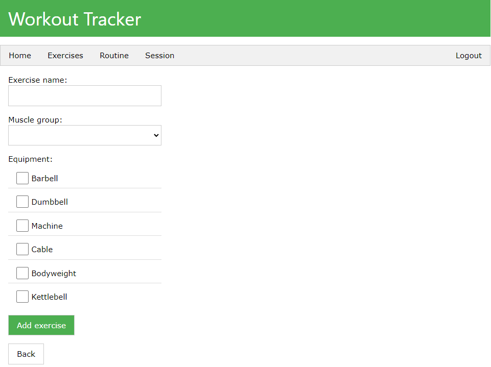

# Workout Tracker

## About

A workout tracker allowing users to create weekly workout plans 🏋️‍♂️

This repo is the client side of a full stack web application, developed on the PERN stack.
This web app allows multiple users to register and log in, add their own exercises, and plan out a weekly workout split.
The server side repo can be found [here](https://github.com/swiderskis/workout-tracker-server).

## Credits

CSS - [W3.CSS](https://www.w3schools.com/w3css/default.asp)

Favicon - [Icons8](https://icons8.com/icon/MOCeYrljNRDk/barbell)
